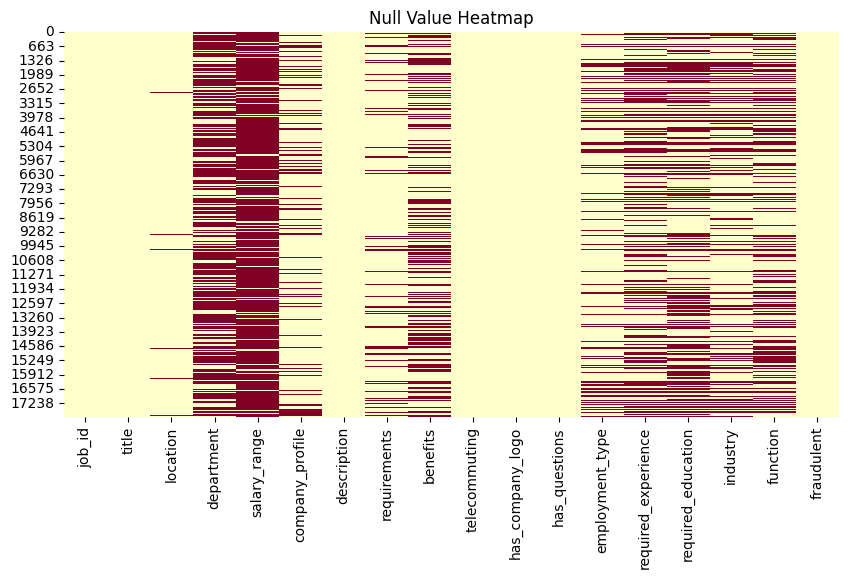
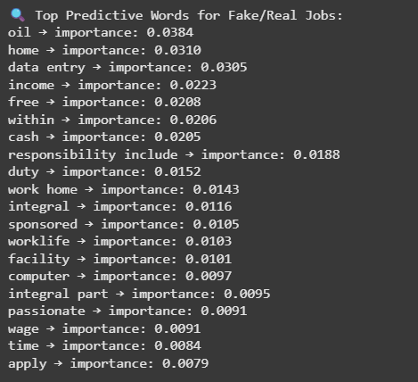
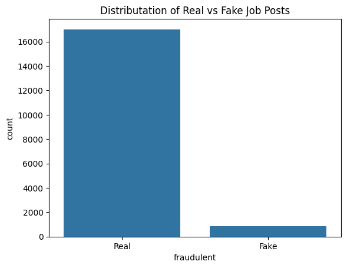
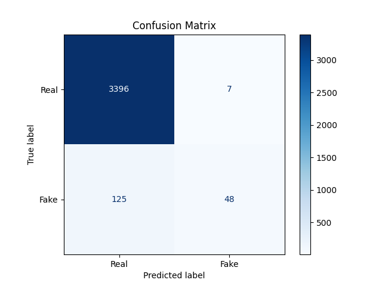
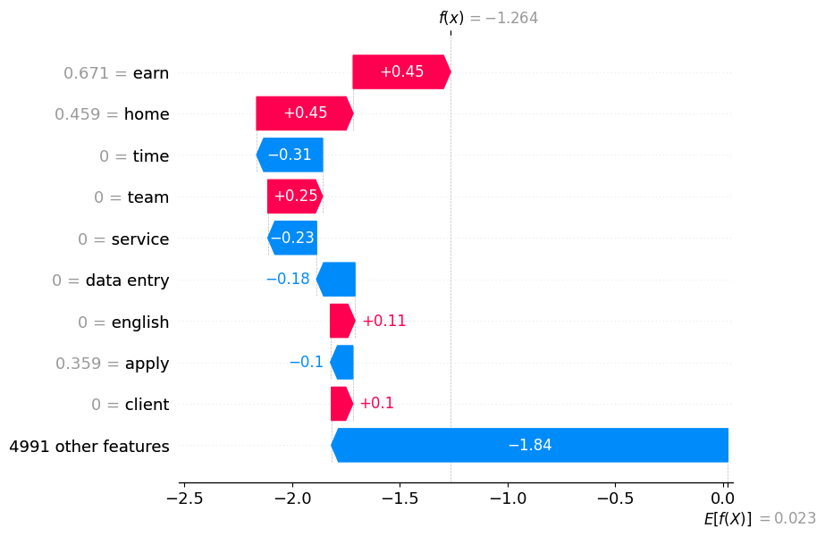

# 🔍 Fake Job Detector using NLP and SHAP Explaination

A Machine Learning and NLP-based project that detects fake job postings using real-world data. It leverages TF-IDF vectorization, XGBoost classifier, and model explainability tools like SHAP to identify and understand fraudulent job descriptions.

---
## 🔑 Key Highlights of the Project

Built an end-to-end Fake Job Detection system using Natural Language Processing  
Used TF-IDF vectorization to extract meaningful patterns from job descriptions  
Trained and optimized an XGBoost classifier to detect fake job postings  
Visualized important insights using word clouds, class imbalance plots, and confusion matrix  
Applied SHAP (SHapley Additive exPlanations) to interpret and explain model predictions  
Validated model fairness and transparency using SHAP force and waterfall plots  
Deployed a user-friendly Streamlit app for real-time fake job classification  

---
## 📦 Features

- Paste any job posting and get real-time predictions  
- Confidence percentage displayed  
- SHAP explanation to visualize important features influencing the decision  
- Built with Streamlit, powered by XGBoost and TF-IDF 
---

## 📁 Project Structure

```
fake-job-detector-using-nlp/
├── app/
│   ├── app.py
│   ├── app.ipynb
│   ├── tfidf_vectorizer.pkl
│   ├── xgb_fake_job_model.pkl
│   └── README.md     ← ⚠️ Start here if you're using the app
├── data/             ← Dataset not stored here due to size
├── notebooks/
│   ├── 01_eda.ipynb                ← Exploratory Data Analysis
│   ├── 02_model_training.ipynb     ← TF-IDF + XGBoost + Metrics
│   ├── 03_explainability.ipynb     ← SHAP visualizations
├── reports_screenshots/
│   ├── wordcloud.png
│   ├── Real-vs-Fake-Job.png
│   ├── Null-value-heatmap.png
│   ├── SHAP-force-plot.png
│   ├── Waterfall-plot.png
│   ├── Top-predictive-words.png
│   ├── results.png
│   ├── classification_report.csv
│   ├── app-ss-1.png
│   ├── app-ss-2.png
├── requirements.txt
└── README.md
```

---

## 📊 Visual Results & Insights

Key insights from the model and data:

| 📌 Description                          | 🖼️ Image |
|----------------------------------------|----------|
| Null Values Heatmap                    |  |
| WordCloud of Most Frequent Terms       |  |
| Top Predictive Words (TF-IDF)          |  |
| Real vs Fake Job Distribution          |  |
| Classification Results (Confusion + Metrics) |  |
| SHAP Force Plot (Explainability)       |  |
| SHAP Waterfall Plot (Single Prediction) |  |

📄 Detailed metrics can also be found in `classification_report.csv`.

---

## 🚀 Live Demo

🔗 **[Click here to use the deployed app on Streamlit →](https://fake-job-detector-using-nlp-op3wr9fxrao2tul767qoax.streamlit.app/)**  
If the app appears blank, please refresh the page once.

---

## 📂 Dataset Access

Due to the 25MB GitHub limit, the dataset is hosted externally:

🔗 [Google Drive – Dataset Folder](https://drive.google.com/drive/folders/1rFXS_Wndua__KcTPd4jMm_cicOmjSxy0?usp=sharing)

---

## ⚙️ How the App Works

Open the [`app/`](./app/) folder and read the included `README.md` for detailed setup instructions.

- If `app.py` doesn't run on your local machine, you can use `app.ipynb` instead.
- Just upload `app.ipynb` to Google Colab.
- Follow instructions there, and:
  - Set up `ngrok` for port forwarding.
  - Replace the dummy `your_token_here` with your actual ngrok token.

---

## 🧠 How I Built This Project

1. **Exploratory Data Analysis** – Cleaned the data, explored nulls, plotted class imbalance.
2. **Model Training** – TF-IDF vectorization + XGBoost classification. Tuned hyperparameters, measured metrics.
3. **Explainability** – Used SHAP (SHapley Additive exPlanations) to interpret why certain jobs are predicted as fake.
4. **App Deployment** – Built a simple Streamlit app for job posting classification.

Check out these notebooks:

```
└── 01_eda.ipynb
└── 02_model_training.ipynb
└── 03_explainability.ipynb
```

---

## 📦 Requirements

Install project dependencies from the main `requirements.txt`:

```bash
pip install -r requirements.txt
```

---

## 🤝 Built By

👨‍💻 **Sonu Kumar**

## 📬 Contact Me

* 🔗 [LinkedIn](https://www.linkedin.com/in/hhsksonu)
* 🔗 [GitHub](https://github.com/hhsksonu)
